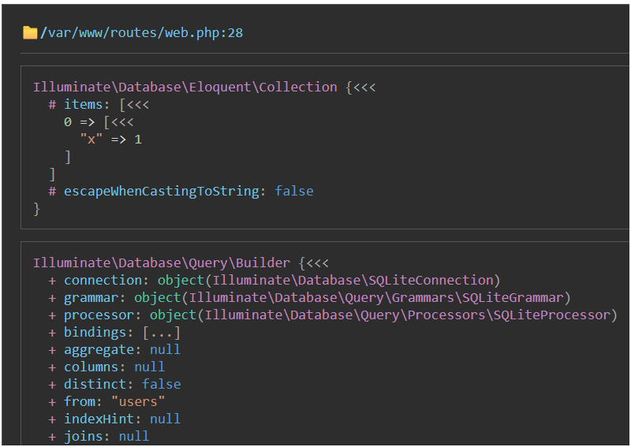
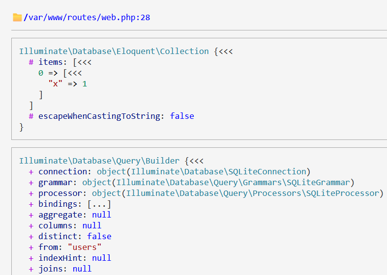
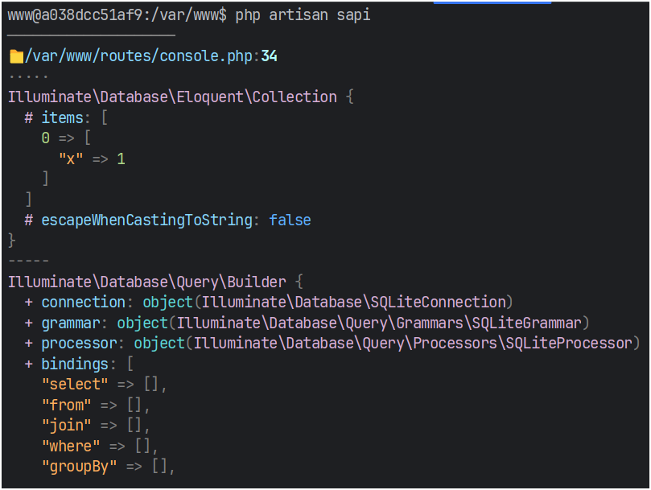

### FEATURE ###
Web Light/Dark/NoColor pretty Theme:
+ Tips: Open/hide array/object by toggle click at: `[<<<, [...], {<<<, {...}` 
<div style="width: 100%;flex-direction: row; gap:0px;">
    
    
</div>

Cli Light/Dark/NoColor pretty Theme
<div style="width: 100%;flex-direction: row; gap:0px;">
    
    
</div>

####  And More... #### 
- Max lines shown
- Max depth shown
- Custom display properties
- Class properties
- Build class properties later (callback)
- Load class properties from plugins

### FOR YOU ###

```php
# IF Laravel: add VariableDebuggerLaravelServiceProvider for Graceful Exit
#   + Laravel 12: add bootstrap/providers.php
#   + Laravel 10: add to config/app.php, at key 'providers'

# Global Config
v_gl_config()
    ->presetCompact(20, true) # recommended
    ->withProjectRootPath(base_path()) # recommended
    ->withMaxDepth(VariableDebugConfig::DEFAULT_MAX_DEPTH) # recommended
    ->withMaxLine(VariableDebugConfig::DEFAULT_MAX_LINE) # recommended
    ->addClassPropertiesFromPluginLaravel() # recommended
    ->addClassPropertiesFromPluginPDO() # recommended
    ->withShowExcludedCount(true) # recommended
    
# Config
$config = \lightla\VariableDebugger\VariableDebugConfig::builder()
    ->presetCompact(15, false)  # shortcut config for compact mode
    ->presetDetailed(15, false) # shortcut config for detailed mode 
    ->useWebThemeDark()         # Default web: Dark
    ->useCliThemeNoColor()      # Default cli: NoColor
    # Show only properties, empty => show ALL (Called: includedProperties)
    ->withProperties(['key1', '0.key1.key2'])   # + WARNING - NOT USE for global config
    # Ignore show properties, empty => skipped (Called: excludedProperties)
    ->withoutProperties(['key1', '0.key1.key2']) # WARNING - NOT USE for global config
    ->addClassProperties(\App\Models\User::class, ['attributes']) # (Called: classIncludedProperties
    ->withShowExcludedCount(true) # # Show Excluded Count or not, Default: true
    # Build Later (Because PDO is a Native Extension, cannot Reflection
    ->addBuildLaterClassProperties(PDO::class, function (PDO $pdo) {
        return ['inTransaction' => $pdo->inTransaction()];
    }) 
    # Add custom plugin
    ->addClassPropertiesFromPlugin(
        new VariableDebugClassPropertyPluginAdapterLaravel()
    ) 
    ->addClassPropertiesFromPluginLaravel() # Plugin snippet for Laravel (if use Laravel)
    ->addClassPropertiesFromPluginPDO() # Plugin snippet for PDO
    ->withShowKeyOnly(true) # WARNING - NOT USE for global config
    ->withIgnoredShowKeyProperties(['field1.key1', 'field2']) # have effected if showKeyOnly enabled
    ->build()

# Usecase
$u = \App\Models\User::factory()->create();

v_dump($u, ['x' => ['tmp1' => 1, 'tmp2' => 2]])
    ->on($config) # override global config

v_dd($u, ['x' => 1, (object)['y' => 1]])
    # override global config
    ->presetCompact(10)
    ->showKeyOnly(['connection', 'attributes.name'])
    ->withProperties(['fillable', 'hidden', 'connection', 'attributes'])
    ->withoutProperties(['hidden'])
;
```

### FOR ME ####

```text
----------------
# Test App (use for test library)
## composer.json: 
## + By default, composer scan from https://packagist.org, if not found, composer scan from repositories
"require": {
    "php": "^8.2",
    "lightla/variable-debugger": "*@dev" 
}
"repositories":[ 
    # Setting for local repo
    {
        "type": "path", 
        "url": "/var/www/this-library" # Docker mount host
    },
    # Setting for private repo
    {
        "type": "vcs",
        "url": "git@github.com-lightla:lightla/variable-debugger.git",
        "options": {
            "no-api": true
        }
    }
],

## Docker mount host for test app
- ../../composer.json:/var/www/this-library/composer.json:ro
- ../../src:/var/www/this-library/src:ro
- ../../tests:/var/www/this-library/tests:ro

----------------
# GIT Knowledge
## Case 1: Git exclude local
• File .git/info/exclude like .gitignore but existing only on my local 
• No have any change or commit on GitHub

## Case 2: Git assume-unchanged
• Báo cho Git "làm như file này không thay đổi"
• Dù bạn sửa file, Git vẫn ignore
• Dùng khi muốn giữ file nhưng không track changes

## GIT SHOW REMOTE TAG
git ls-remote --tags origin

## GIT DELETE TAG VIA Pattern
git tag \
| grep "^v1\.0\." \
| grep -Ev "v1\.0\.16|v1\.0\.17" \
| xargs -r git tag -d

----------------
# Test
./vendor/bin/pest this-library/tests
./vendor/bin/phpunit this-library/tests --testdox
./vendor/bin/pest this-library/tests --testdox
```